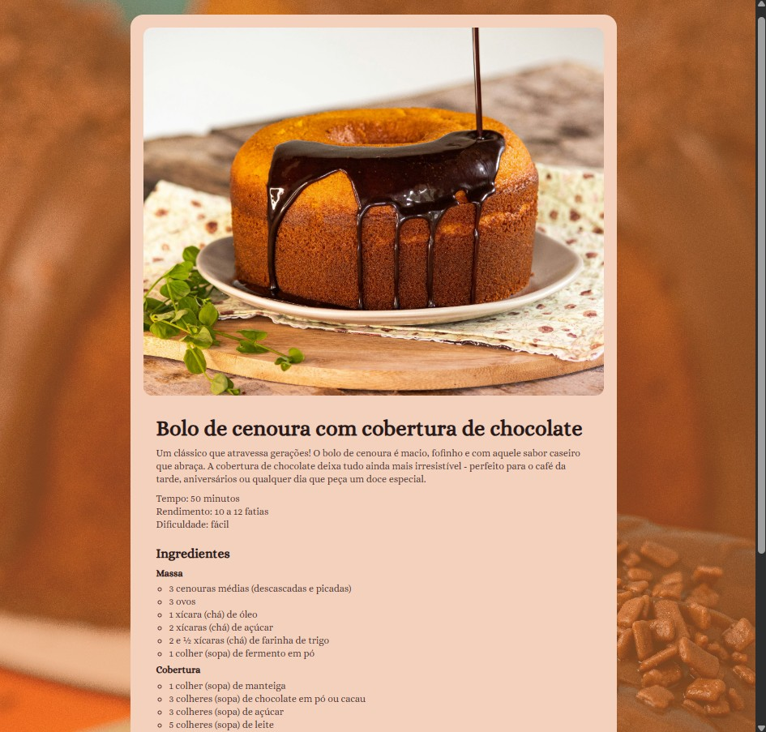

# Recipes Page

## Description
This project is a responsive single-page website that showcases a traditional Brazilian carrot cake recipe. It presents the ingredients and preparation steps in a clean and visually appealing layout.

## Technologies Used
- HTML5
- CSS3

## How to View
1. Clone or download the repository.
2. Open `index.html` in your web browser.

## Assets
Images and icons are stored in the `assets/` folder.

## Credits
- Original project by Rocketseat (Full-Stack Formation – Recipe Page)
- Modified by Gabriela Spanemberg Bado
- Images: Unsplash (Amanda Kariella, Fernando Stahelin)

## License
This project is for educational purposes.

## Preview

> Exemplo da interface do projeto.